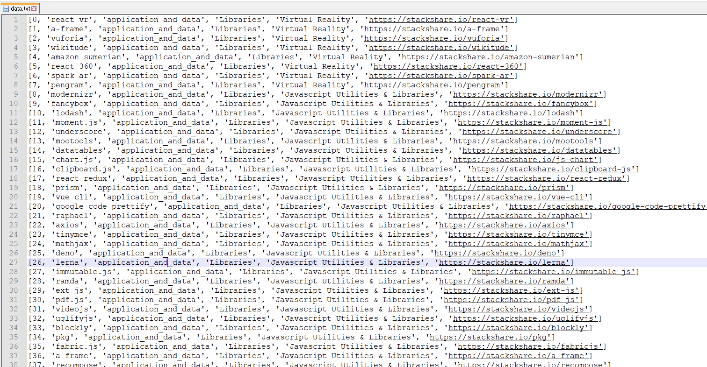

# stackcrawler

### - 2021-04-29

- google debuger mode 실행 코드
- google 자동 로그인 코드
- share_stack 로그인 우회 코드

- 카테고리, 그룹별 기술 스택 접근 코드

- 추후에 데이터 베이스 계획 수립 및 데이터 저장 예정 

`사용을 위해서는 코드에 구글 이메일과 비밀번호를 넣어줘야 함`

### - 2021-05-07

- 일부 코드 모듈화 및 최적화

- tech stack 리스트에서 카테고리 및 그룹 데이터 저장 코드 

- tech stack 크롤링 후 데이터 저장 (data.txt) : 현재 18358개의 기술 스택에 대한 정보 저장

  - [id_num, stack이름, 카테고리, 세부항목1, 세부항목2, 세부 url] 로 구성

- 추후에 DB화 진행 및 데이터 가공 실시 예정 (단어 규격 통일)

- 현재 저장된 형식은 다음과 같음

  

